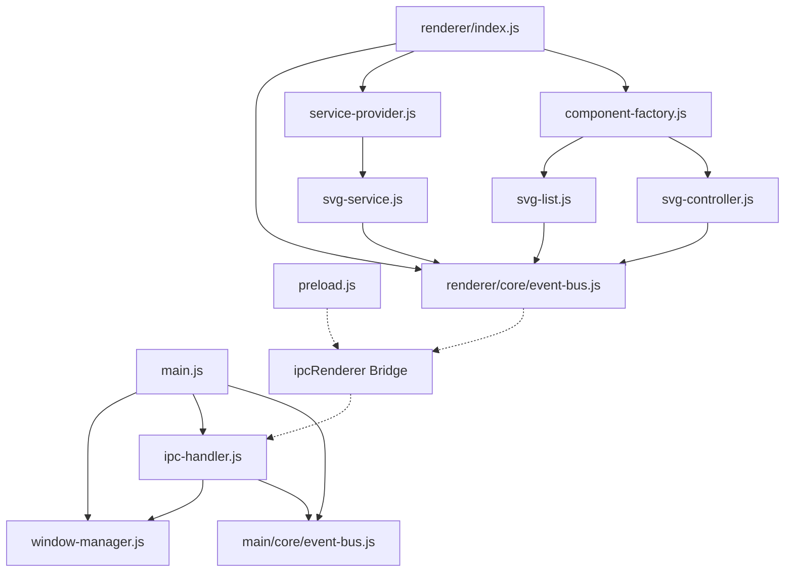

# Clean Event Bus Implementation for Electron with Emoji-Based Code Sections

This document provides a complete implementation plan for rebuilding an event bus system for an Electron application, using emoji-based code sections for improved readability and organization.

## Table of Contents

1. [Project Structure](#project-structure)
2. [Core Components](#core-components)
3. [Module Dependencies](#module-dependencies)
4. [Implementation Steps](#implementation-steps)
5. [Testing Strategy](#testing-strategy)
6. [Integration Examples](#integration-examples)

## Project Structure

```
project-root/
├── main/
│   ├── main.js                 # Main process entry point
│   ├── window-manager.js       # Window creation and management
│   ├── ipc-handler.js          # IPC communication
│   ├── file-operations.js      # File system operations
│   └── core/
│       ├── event-bus.js        # Main process event bus
│       └── error-handler.js    # Error handling
├── renderer/
│   ├── index.js                # Renderer entry point
│   ├── core/
│   │   ├── event-bus.js        # Renderer event bus
│   │   └── error-handler.js    # Error handling
│   ├── components/
│   │   ├── component-factory.js # Component registry
│   │   ├── svg-list.js         # SVG selection component
│   │   └── svg-controller.js   # SVG control component
│   ├── services/
│   │   ├── service-provider.js # Service management
│   │   └── svg-service.js      # SVG operations
│   ├── config/
│   │   └── constants.js        # Event types & constants
│   └── utils/
│       ├── logger.js           # Logging functionality
│       └── validation.js       # Input validation
├── preload/
│   └── preload.js              # Preload script bridge
├── public/
│   ├── index.html              # Main HTML file
│   └── styles/                 # CSS styles
├── test/
│   ├── main/                   # Main process tests
│   └── renderer/               # Renderer process tests
├── package.json
└── README.md
```

## Core Components

### Main Process Implementation

#### main.js
```javascript
// 🚀 START: Main Process Entry Point 🚀
const { app, BrowserWindow } = require('electron');
const path = require('path');
const WindowManager = require('./window-manager');
const IpcHandler = require('./ipc-handler');
const { EventBus } = require('./core/event-bus');

// Create singleton instances
const eventBus = new EventBus({ debug: process.env.NODE_ENV === 'development' });
const windowManager = new WindowManager(eventBus);
let ipcHandler;

// 🔷 START: App Lifecycle 🔷
// App ready handler
app.whenReady().then(() => {
  // Create the main window
  windowManager.createWindow();
  
  // Initialize IPC handler with event bus
  ipcHandler = new IpcHandler(eventBus, windowManager);
  
  app.on('activate', function () {
    // On macOS re-create a window when the dock icon is clicked
    if (windowManager.getMainWindow() === null) {
      windowManager.createWindow();
    }
  });
  
  // Log application started
  eventBus.emit('app:started', { timestamp: Date.now() });
});

// Quit when all windows are closed, except on macOS
app.on('window-all-closed', function () {
  eventBus.emit('app:windows-closed', { platform: process.platform });
  
  if (process.platform !== 'darwin') app.quit();
});

// Handle app before quit
app.on('before-quit', () => {
  eventBus.emit('app:before-quit');
});
// 🔹 END: App Lifecycle 🔹
// 🛬 END: Main Process Entry Point 🛬
```

#### window-manager.js
```javascript
// 🚀 START: Window Manager Implementation 🚀
const { BrowserWindow, screen } = require('electron');
const path = require('path');

// 🔶 START: Window Manager Class Definition 🔶
class WindowManager {
  // 🔷 START: Constructor 🔷
  constructor(eventBus) {
    this.mainWindow = null;
    this.eventBus = eventBus;
    
    // Subscribe to events
    this.eventBus.on('window:reload', this.handleReload.bind(this));
    this.eventBus.on('window:toggle-fullscreen', this.handleToggleFullscreen.bind(this));
  }
  // 🔹 END: Constructor 🔹

  // 🔷 START: Window Creation 🔷
  /**
   * Create the main application window
   */
  createWindow() {
    // Get screen size
    const { width, height } = screen.getPrimaryDisplay().workAreaSize;
    
    // Create the browser window
    this.mainWindow = new BrowserWindow({
      width: Math.min(1200, width),
      height: Math.min(800, height),
      webPreferences: {
        nodeIntegration: false,
        contextIsolation: true,
        preload: path.join(__dirname, '../preload/preload.js')
      },
      show: false,
      backgroundColor: '#1e1e1e'
    });
    
    // Load the index.html file
    this.mainWindow.loadFile(path.join(__dirname, '../public/index.html'));
    
    // Show window when ready
    this.mainWindow.once('ready-to-show', () => {
      this.mainWindow.show();
      
      // Emit window created event
      this.eventBus.emit('window:created', {
        id: this.mainWindow.id,
        bounds: this.mainWindow.getBounds()
      });
    });
    
    // Window closed event
    this.mainWindow.on('closed', () => {
      this.mainWindow = null;
      this.eventBus.emit('window:closed');
    });
    
    // Window moved or resized
    this.mainWindow.on('moved', () => {
      this.eventBus.emit('window:moved', {
        bounds: this.mainWindow.getBounds()
      });
    });
    
    return this.mainWindow;
  }
  // 🔹 END: Window Creation 🔹

  // 🔷 START: Window Operations 🔷
  /**
   * Get the main window instance
   */
  getMainWindow() {
    return this.mainWindow;
  }
  
  /**
   * Handle window reload request
   */
  handleReload() {
    if (this.mainWindow) {
      this.mainWindow.reload();
    }
  }
  
  /**
   * Toggle fullscreen mode
   */
  handleToggleFullscreen() {
    if (this.mainWindow) {
      const isFullScreen = this.mainWindow.isFullScreen();
      this.mainWindow.setFullScreen(!isFullScreen);
      
      this.eventBus.emit('window:fullscreen-changed', {
        isFullScreen: !isFullScreen
      });
    }
  }
  // 🔹 END: Window Operations 🔹
}
// 🔶 END: Window Manager Class Definition 🔶

module.exports = WindowManager;
// 🛬 END: Window Manager Implementation 🛬
```

#### ipc-handler.js
```javascript
// 🚀 START: IPC Handler Implementation 🚀
const { ipcMain } = require('electron');

// 🔶 START: IPC Handler Class Definition 🔶
class IpcHandler {
  // 🔷 START: Constructor 🔷
  constructor(eventBus, windowManager) {
    this.eventBus = eventBus;
    this.windowManager = windowManager;
    
    // Register IPC handlers
    this.registerHandlers();
    
    // Listen for events that need to be sent to renderer
    this.subscribeToEvents();
  }
  // 🔹 END: Constructor 🔹

  // 🔷 START: IPC Registration 🔷
  /**
   * Register all IPC event handlers
   */
  registerHandlers() {
    // Handle events from renderer
    ipcMain.handle('event:emit', this.handleEventEmit.bind(this));
    ipcMain.handle('file:list-svgs', this.handleListSvgs.bind(this));
    ipcMain.handle('file:read-svg', this.handleReadSvg.bind(this));
    ipcMain.handle('window:toggle-fullscreen', this.handleToggleFullscreen.bind(this));
  }
  
  /**
   * Subscribe to event bus events that should be sent to renderer
   */
  subscribeToEvents() {
    // Events that should be forwarded to the renderer
    const forwardedEvents = [
      'svg:selected',
      'svg:displayed',
      'app:error'
    ];
    
    // Subscribe to each event
    forwardedEvents.forEach(eventType => {
      this.eventBus.on(eventType, data => {
        this.sendToRenderer(eventType, data);
      });
    });
  }
  // 🔹 END: IPC Registration 🔹

  // 🔷 START: Event Handling 🔷
  /**
   * Handle event emission from renderer
   */
  handleEventEmit(event, { eventType, data }) {
    try {
      // Prefix to distinguish renderer-originated events
      const prefixedEventType = `renderer:${eventType}`;
      
      // Emit on the main process event bus
      this.eventBus.emit(prefixedEventType, data);
      
      return { success: true };
    } catch (error) {
      console.error('Error handling renderer event:', error);
      return { 
        success: false, 
        error: error.message 
      };
    }
  }
  
  /**
   * Handle request to list SVG files
   */
  handleListSvgs() {
    // This would use file-operations to get SVG files
    // For now, return mock data
    return [
      { id: 'svg-001', name: 'Circle.svg', path: '/path/to/circle.svg' },
      { id: 'svg-002', name: 'Square.svg', path: '/path/to/square.svg' },
      { id: 'svg-003', name: 'Triangle.svg', path: '/path/to/triangle.svg' }
    ];
  }
  
  /**
   * Handle request to read SVG file
   */
  handleReadSvg(event, { path }) {
    // This would use file-operations to read the SVG file
    // For now, return mock data
    return '<svg width="100" height="100"><circle cx="50" cy="50" r="40" fill="blue"/></svg>';
  }
  
  /**
   * Handle request to toggle fullscreen
   */
  handleToggleFullscreen() {
    this.eventBus.emit('window:toggle-fullscreen');
    return { success: true };
  }
  // 🔹 END: Event Handling 🔹

  // 🔷 START: Renderer Communication 🔷
  /**
   * Send event to renderer process
   */
  sendToRenderer(eventType, data) {
    const mainWindow = this.windowManager.getMainWindow();
    if (mainWindow && !mainWindow.isDestroyed()) {
      mainWindow.webContents.send('event:from-main', { eventType, data });
    }
  }
  // 🔹 END: Renderer Communication 🔹
}
// 🔶 END: IPC Handler Class Definition 🔶

module.exports = IpcHandler;
// 🛬 END: IPC Handler Implementation 🛬
```

#### core/event-bus.js (Main Process)
```javascript
// 🚀 START: Main Process Event Bus 🚀

// 🔶 START: Event Bus Class Definition 🔶
class EventBus {
  // 🔷 START: Constructor 🔷
  constructor(options = {}) {
    this.listeners = {};
    this.debug = options.debug || false;
    
    // Set up error event handling to prevent infinite loops
    this.setupErrorHandling();
    
    if (this.debug) {
      console.log('Main process EventBus initialized');
    }
  }
  // 🔹 END: Constructor 🔹

  // 🔷 START: Error Handling Setup 🔷
  /**
   * Set up error handling to prevent infinite loops
   */
  setupErrorHandling() {
    // Add special handling for error events
    this.on('app:error', (errorData) => {
      console.error(`Error event received:`, errorData);
    });
  }
  // 🔹 END: Error Handling Setup 🔹

  // 🔷 START: Event Subscription 🔷
  /**
   * Subscribe to an event
   * @param {string} event - The event to subscribe to
   * @param {Function} callback - The event handler function
   * @returns {Function} - Unsubscribe function
   */
  on(event, callback) {
    if (!this.listeners[event]) {
      this.listeners[event] = [];
    }
    
    this.listeners[event].push(callback);
    
    if (this.debug) {
      console.log(`Subscribed to event: ${event}`);
    }
    
    // Return unsubscribe function
    return () => this.off(event, callback);
  }
  // 🔹 END: Event Subscription 🔹

  // 🔷 START: Event Unsubscription 🔷
  /**
   * Unsubscribe from an event
   * @param {string} event - The event to unsubscribe from
   * @param {Function} callback - The handler to remove
   */
  off(event, callback) {
    if (!this.listeners[event]) return;
    
    this.listeners[event] = this.listeners[event].filter(cb => cb !== callback);
    
    if (this.listeners[event].length === 0) {
      delete this.listeners[event];
    }
    
    if (this.debug) {
      console.log(`Unsubscribed from event: ${event}`);
    }
  }
  // 🔹 END: Event Unsubscription 🔹

  // 🔷 START: Event Emission 🔷
  /**
   * Emit an event with data to all subscribers
   * @param {string} event - The event to emit
   * @param {any} data - Data to pass to subscribers
   */
  emit(event, data) {
    if (this.debug) {
      console.log(`Emitting event: ${event}`, data);
    }
    
    if (!this.listeners[event]) return;
    
    this.listeners[event].forEach(callback => {
      try {
        callback(data);
      } catch (error) {
        console.error(`Error in event handler for '${event}':`, error);
        
        // Prevent infinite loops when handling errors
        if (event !== 'app:error') {
          this.emit('app:error', {
            originalEvent: event,
            error: error.message,
            stack: error.stack,
            data
          });
        }
      }
    });
  }
  // 🔹 END: Event Emission 🔹

  // 🔷 START: Event Management 🔷
  /**
   * Remove all listeners for an event
   * @param {string} event - Event to remove listeners for
   */
  removeAllListeners(event) {
    if (event) {
      delete this.listeners[event];
    } else {
      this.listeners = {};
    }
    
    if (this.debug) {
      console.log(`Removed all listeners${event ? ` for event: ${event}` : ''}`);
    }
  }
  
  /**
   * Get all registered event types
   * @returns {string[]} - Array of event types
   */
  getEventTypes() {
    return Object.keys(this.listeners);
  }
  // 🔹 END: Event Management 🔹
}
// 🔶 END: Event Bus Class Definition 🔶

module.exports = { EventBus };
// 🛬 END: Main Process Event Bus 🛬
```

### Preload Script Implementation

#### preload.js
```javascript
// 🚀 START: Preload Script 🚀
const { contextBridge, ipcRenderer } = require('electron');

// 🔷 START: API Exposure 🔷
// Expose protected methods that allow the renderer process to use
// the ipcRenderer without exposing the entire object
contextBridge.exposeInMainWorld('api', {
  // Event handling
  send: (channel, data) => {
    // Whitelist channels
    const validChannels = ['event:emit'];
    if (validChannels.includes(channel)) {
      return ipcRenderer.invoke(channel, data);
    }
    return Promise.reject(new Error('Invalid channel'));
  },
  
  // Receive events from main process
  receive: (callback) => {
    ipcRenderer.on('event:from-main', (event, args) => callback(args));
  },
  
  // File operations
  files: {
    listSvgs: () => ipcRenderer.invoke('file:list-svgs'),
    readSvg: (path) => ipcRenderer.invoke('file:read-svg', { path })
  },
  
  // Window operations
  window: {
    toggleFullscreen: () => ipcRenderer.invoke('window:toggle-fullscreen')
  }
});
// 🔹 END: API Exposure 🔹
// 🛬 END: Preload Script 🛬
```

### Renderer Process Implementation

#### renderer/index.js
```javascript
// 🚀 START: Renderer Entry Point 🚀
import { EventBus } from './core/event-bus.js';
import { EventTypes } from './config/constants.js';
import ServiceProvider from './services/service-provider.js';
import SvgService from './services/svg-service.js';
import ComponentFactory from './components/component-factory.js';
import SvgList from './components/svg-list.js';
import SvgController from './components/svg-controller.js';

// 🔷 START: App Initialization 🔷
/**
 * Initialize the application
 */
async function initializeApp() {
  console.log('Initializing application...');
  
  try {
    // Create event bus
    const eventBus = new EventBus({
      debug: true,
      bridgeToMain: true
    });
    
    // Create service provider
    const serviceProvider = new ServiceProvider(eventBus);
    
    // Register services
    serviceProvider.register('svg', new SvgService(eventBus));
    
    // Initialize services
    await serviceProvider.initializeServices();
    
    // Create component factory
    const componentFactory = new ComponentFactory(eventBus);
    
    // Register components
    componentFactory.register('svg-list', new SvgList(eventBus));
    componentFactory.register('svg-controller', new SvgController(eventBus));
    
    // Initialize components
    componentFactory.initializeComponents();
    
    // Expose for debugging
    window.App = {
      eventBus,
      serviceProvider,
      componentFactory
    };
    
    // Emit application ready event
    eventBus.emit(EventTypes.APP_READY, {
      timestamp: Date.now()
    });
    
    console.log('Application initialized successfully');
    return true;
  } catch (error) {
    console.error('Failed to initialize application:', error);
    return false;
  }
}
// 🔹 END: App Initialization 🔹

// 🔷 START: App Bootstrap 🔷
// Initialize when DOM is ready
document.addEventListener('DOMContentLoaded', () => {
  console.log('DOM Content Loaded, starting initialization');
  
  initializeApp().then(success => {
    if (success) {
      console.log('Application ready');
    } else {
      console.error('Application failed to initialize');
    }
  });
});
// 🔹 END: App Bootstrap 🔹
// 🛬 END: Renderer Entry Point 🛬
```

#### renderer/core/event-bus.js (Renderer Process)
```javascript
// 🚀 START: Renderer Event Bus 🚀
import { logEvent, logError } from '../utils/logger.js';

// 🔶 START: Event Bus Class Definition 🔶
export class EventBus {
  // 🔷 START: Constructor 🔷
  constructor(options = {}) {
    this.listeners = {};
    this.debug = options.debug || false;
    this.bridgeToMain = options.bridgeToMain || false;
    
    // If bridging to main process, set up the connection
    if (this.bridgeToMain) {
      this.setupMainProcessBridge();
    }
    
    if (this.debug) {
      logEvent('INFO', 'EventBus initialized', options);
    }
  }
  // 🔹 END: Constructor 🔹

  // 🔷 START: Main Process Bridge 🔷
  /**
   * Set up the connection to the main process
   */
  setupMainProcessBridge() {
    // Listen for events from main process
    window.api.receive(({ eventType, data }) => {
      // Log events from main process
      if (this.debug) {
        logEvent('INFO', `From Main: ${eventType}`, data);
      }
      
      // Emit received events locally
      this.emit(eventType, data);
    });
  }
  // 🔹 END: Main Process Bridge 🔹

  // 🔷 START: Event Subscription 🔷
  /**
   * Subscribe to an event
   * @param {string} event - The event to subscribe to
   * @param {Function} callback - The event handler function
   * @returns {Function} - Unsubscribe function
   */
  on(event, callback) {
    if (!this.listeners[event]) {
      this.listeners[event] = [];
    }
    
    this.listeners[event].push(callback);
    
    if (this.debug) {
      logEvent('DEBUG', `Subscribed to '${event}'`, {
        handlerName: callback.name || 'anonymous'
      });
    }
    
    // Return unsubscribe function
    return () => this.off(event, callback);
  }
  // 🔹 END: Event Subscription 🔹

  // 🔷 START: Event Unsubscription 🔷
  /**
   * Unsubscribe from an event
   * @param {string} event - The event to unsubscribe from
   * @param {Function} callback - The handler to remove
   */
  off(event, callback) {
    if (!this.listeners[event]) return;
    
    this.listeners[event] = this.listeners[event].filter(cb => cb !== callback);
    
    if (this.listeners[event].length === 0) {
      delete this.listeners[event];
    }
    
    if (this.debug) {
      logEvent('DEBUG', `Unsubscribed from '${event}'`, {
        handlerName: callback.name || 'anonymous'
      });
    }
  }
  // 🔹 END: Event Unsubscription 🔹

  // 🔷 START: Event Emission 🔷
  /**
   * Emit an event with data to all subscribers
   * @param {string} event - The event to emit
   * @param {any} data - Data to pass to subscribers
   */
  emit(event, data) {
    if (this.debug) {
      logEvent('DEBUG', `Emitting '${event}'`, data);
    }
    
    // If bridging to main, send to main process
    if (this.bridgeToMain) {
      this.sendToMain(event, data);
    }
    
    if (!this.listeners[event]) return;
    
    this.listeners[event].forEach(callback => {
      try {
        callback(data);
      } catch (error) {
        logError(`Error in '${event}' handler:`, error);
        
        // Prevent infinite loops with error events
        if (event !== 'error') {
          this.emit('error', {
            originalEvent: event,
            error: error.message,
            stack: error.stack,
            data
          });
        }
      }
    });
  }
  // 🔹 END: Event Emission 🔹

  // 🔷 START: Main Process Communication 🔷
  /**
   * Send event to main process
   * @param {string} eventType - The event type
   * @param {any} data - The event data
   */
  async sendToMain(eventType, data) {
    try {
      // Only send certain events to avoid circular events
      const shouldForward = !eventType.startsWith('error:') && 
                           !eventType.startsWith('log:');
      
      if (shouldForward) {
        await window.api.send('event:emit', { eventType, data });
      }
    } catch (error) {
      logError('Failed to send event to main process:', error);
    }
  }
  // 🔹 END: Main Process Communication 🔹
}
// 🔶 END: Event Bus Class Definition 🔶
// 🛬 END: Renderer Event Bus 🛬
```

#### renderer/config/constants.js
```javascript
// 🚀 START: Constants Definition 🚀

// 🔷 START: Event Types 🔷
/**
 * Event types used throughout the application
 */
export const EventTypes = {
  // Application events
  APP_READY: 'app:ready',
  APP_ERROR: 'app:error',
  
  // UI events
  UI_THEME_CHANGED: 'ui:theme-changed',
  UI_LAYOUT_CHANGED: 'ui:layout-changed',
  UI_FULLSCREEN_TOGGLED: 'ui:fullscreen-toggled',
  
  // Component events
  COMPONENT_MOUNTED: 'component:mounted',
  COMPONENT_UNMOUNTED: 'component:unmounted',
  
  // SVG events
  SVG_SELECTED: 'svg:selected',
  SVG_DISPLAYED: 'svg:displayed',
  SVG_HIDDEN: 'svg:hidden',
  SVG_REMOVED: 'svg:removed',
  SVG_POSITION_CHANGED: 'svg:position-changed',
  
  // Command events (requests to do something)
  COMMAND_SELECT_SVG: 'command:select-svg',
  COMMAND_DISPLAY_SVG: 'command:display-svg',
  COMMAND_HIDE_SVG: 'command:hide-svg',
  COMMAND_REMOVE_SVG: 'command:remove-svg',
  COMMAND_MOVE_SVG: 'command:move-svg',
  
  // Service events
  SERVICE_INITIALIZED: 'service:initialized',
  SERVICE_ERROR: 'service:error'
};
// 🔹 END: Event Types 🔹

// 🔷 START: Element IDs 🔷
/**
 * DOM element IDs
 */
export const ElementIds = {
  APP_CONTAINER: 'app-container',
  SVG_LIST_CONTAINER: 'svg-list-container',
  SVG_DISPLAY_AREA: 'svg-display-area',
  CONTROL_PANEL: 'control-panel',
  SETTINGS_PANEL: 'settings-panel'
};
// 🔹 END: Element IDs 🔹

// 🔷 START: Class Names 🔷
/**
 * CSS class names
 */
export const ClassNames = {
  ACTIVE: 'active',
  SELECTED: 'selected',
  DRAGGABLE: 'draggable',
  DRAGGING: 'dragging',
  HIDDEN: 'hidden',
  VISIBLE: 'visible',
  ERROR: 'error',
  SUCCESS: 'success',
  WARNING: 'warning'
};
// 🔹 END: Class Names 🔹

// 🔷 START: Local Storage Keys 🔷
/**
 * LocalStorage keys
 */
export const StorageKeys = {
  THEME: 'svg-overlay-theme',
  LAYOUT: 'svg-overlay-layout',
  RECENT_SVGS: 'svg-overlay-recent-svgs',
  SETTINGS: 'svg-overlay-settings'
};
// 🔹 END: Local Storage Keys 🔹
// 🛬 END: Constants Definition 🛬
```

## Module Dependencies



## Implementation Steps

### Phase 1: Core Event Bus Implementation

1. **Setup Main Process Event Bus**
   - Implement the core EventBus class in main/core/event-bus.js
   - Add error handling with try/catch in emit method
   - Add debugging capabilities

2. **Setup Renderer Process Event Bus**
   - Implement EventBus class in renderer/core/event-bus.js
   - Add bridge to main process
   - Implement error handling

3. **Setup Preload Script**
   - Implement secure bridge for IPC
   - Expose only necessary methods

### Phase 2: Main Process Implementation

1. **Setup Window Manager**
   - Implement window creation and management
   - Add event emission for window events

2. **Setup IPC Handler**
   - Implement handler for renderer-to-main communication
   - Add event forwarding from main to renderer

3. **Setup Main Entry Point**
   - Initialize main components
   - Set up app lifecycle event handling

### Phase 3: Renderer Process Implementation

1. **Setup Component System**
   - Implement component factory
   - Create base SVG components

2. **Setup Service System**
   - Implement service provider
   - Create SVG service

3. **Setup Constants and Utils**
   - Define event types and constants
   - Create logging and validation utilities

### Phase 4: Integration and Testing

1. **Test Main-Renderer Communication**
   - Verify event passing between processes
   - Test error handling

2. **Test Component Event Flow**
   - Verify component lifecycle events
   - Test SVG operations

3. **Test Service Event Flow**
   - Verify service initialization
   - Test service operations

## Testing Strategy

### Main Process Testing

```javascript
// 🚀 START: Main Process Event Bus Tests 🚀
const { EventBus } = require('../../main/core/event-bus');
const assert = require('assert');

describe('Main Process EventBus', () => {
  let eventBus;
  
  beforeEach(() => {
    eventBus = new EventBus({ debug: false });
  });
  
  it('should subscribe to and emit events', () => {
    let receivedData = null;
    const testData = { test: 'data' };
    
    eventBus.on('test-event', (data) => {
      receivedData = data;
    });
    
    eventBus.emit('test-event', testData);
    
    assert.deepStrictEqual(receivedData, testData);
  });
  
  it('should handle unsubscribing', () => {
    let callCount = 0;
    const handler = () => { callCount++; };
    
    const unsubscribe = eventBus.on('test-event', handler);
    eventBus.emit('test-event');
    assert.strictEqual(callCount, 1);
    
    unsubscribe();
    eventBus.emit('test-event');
    assert.strictEqual(callCount, 1);
  });
  
  it('should handle errors in event handlers', () => {
    let errorEventData = null;
    const testData = { test: 'data' };
    
    eventBus.on('app:error', (data) => {
      errorEventData = data;
    });
    
    eventBus.on('error-event', () => {
      throw new Error('Test error');
    });
    
    eventBus.emit('error-event', testData);
    
    assert.strictEqual(errorEventData.originalEvent, 'error-event');
    assert.strictEqual(errorEventData.error, 'Test error');
    assert.deepStrictEqual(errorEventData.data, testData);
  });
});
// 🛬 END: Main Process Event Bus Tests 🛬
```

### Renderer Process Testing

```javascript
// 🚀 START: Renderer Event Bus Tests 🚀
import { EventBus } from '../../renderer/core/event-bus';

describe('Renderer EventBus', () => {
  let eventBus;
  
  beforeEach(() => {
    // Mock window.api
    global.window = {
      api: {
        send: jest.fn().mockResolvedValue({}),
        receive: jest.fn()
      }
    };
    
    eventBus = new EventBus({ debug: false });
  });
  
  it('should subscribe to and emit events', () => {
    const handler = jest.fn();
    const testData = { test: 'data' };
    
    eventBus.on('test-event', handler);
    eventBus.emit('test-event', testData);
    
    expect(handler).toHaveBeenCalledWith(testData);
  });
  
  it('should handle unsubscribing', () => {
    const handler = jest.fn();
    
    const unsubscribe = eventBus.on('test-event', handler);
    eventBus.emit('test-event');
    expect(handler).toHaveBeenCalledTimes(1);
    
    unsubscribe();
    eventBus.emit('test-event');
    expect(handler).toHaveBeenCalledTimes(1);
  });
  
  it('should handle errors in event handlers', () => {
    const errorHandler = jest.fn();
    const testData = { test: 'data' };
    
    eventBus.on('error', errorHandler);
    
    eventBus.on('error-event', () => {
      throw new Error('Test error');
    });
    
    eventBus.emit('error-event', testData);
    
    expect(errorHandler).toHaveBeenCalled();
    expect(errorHandler.mock.calls[0][0].originalEvent).toBe('error-event');
    expect(errorHandler.mock.calls[0][0].error).toBe('Test error');
  });
  
  it('should bridge events to main process when configured', () => {
    eventBus = new EventBus({ debug: false, bridgeToMain: true });
    const testData = { test: 'data' };
    
    eventBus.emit('test-event', testData);
    
    expect(window.api.send).toHaveBeenCalledWith('event:emit', {
      eventType: 'test-event',
      data: testData
    });
  });
});
// 🛬 END: Renderer Event Bus Tests 🛬
```

## Integration Examples

### Basic SVG Display Flow

```javascript
// 🚀 START: SVG Flow Integration Example 🚀
// 1. User clicks on an SVG in the list component
svgList.handleItemClick('svg-001');

// 2. SvgList component emits a command
eventBus.emit(EventTypes.COMMAND_SELECT_SVG, { id: 'svg-001' });

// 3. SvgService handles the command
svgService.handleSelectSvg({ id: 'svg-001' });

// 4. SvgService loads the SVG and emits an event
eventBus.emit(EventTypes.SVG_SELECTED, {
  id: 'svg-001',
  name: 'Circle.svg',
  content: '<svg>...</svg>'
});

// 5. SvgController receives the selected SVG event
svgController.handleSvgSelected({
  id: 'svg-001',
  name: 'Circle.svg',
  content: '<svg>...</svg>'
});

// 6. User clicks on a display area
svgController.handleDisplayAreaClick('quadrant-1');

// 7. SvgController emits a command
eventBus.emit(EventTypes.COMMAND_DISPLAY_SVG, {
  id: 'svg-001',
  target: 'quadrant-1'
});

// 8. SvgService handles the command
svgService.handleDisplaySvg({
  id: 'svg-001',
  target: 'quadrant-1'
});

// 9. SvgService displays the SVG and emits an event
eventBus.emit(EventTypes.SVG_DISPLAYED, {
  id: 'svg-001',
  target: 'quadrant-1',
  position: { x: 0, y: 0 }
});

// 10. SvgController updates the UI
svgController.handleSvgDisplayed({
  id: 'svg-001',
  target: 'quadrant-1',
  position: { x: 0, y: 0 }
});
// 🛬 END: SVG Flow Integration Example 🛬
```

### Error Handling Example

```javascript
// 🚀 START: Error Handling Example 🚀
// 1. Attempt to display an invalid SVG
try {
  svgService.handleDisplaySvg({
    id: 'invalid-id',
    target: 'quadrant-1'
  });
} catch (error) {
  // 2. SvgService throws an error
  console.error('Failed to display SVG:', error);
  
  // 3. The EventBus catches the error in the emit method
  eventBus.emit(EventTypes.SERVICE_ERROR, {
    service: 'SvgService',
    method: 'handleDisplaySvg',
    error: error.message
  });
  
  // 4. Error handler in main process receives the error
  mainProcessEventBus.on(EventTypes.SERVICE_ERROR, (data) => {
    console.error('Service error in main process:', data);
    
    // 5. Main process sends error to renderer
    ipcHandler.sendToRenderer(EventTypes.APP_ERROR, {
      source: 'main',
      ...data
    });
  });
  
  // 6. Renderer error handler displays the error
  rendererEventBus.on(EventTypes.APP_ERROR, (data) => {
    console.error('Application error:', data);
    
    // Display error in UI
    const errorElement = document.createElement('div');
    errorElement.className = ClassNames.ERROR;
    errorElement.textContent = `Error: ${data.error}`;
    document.getElementById(ElementIds.APP_CONTAINER).appendChild(errorElement);
    
    // Auto-remove after 5 seconds
    setTimeout(() => {
      errorElement.remove();
    }, 5000);
  });
}
// 🛬 END: Error Handling Example 🛬
```

This implementation guide provides a complete blueprint for rebuilding your event bus system for an Electron application with clear emoji-based section markers. Each module is organized with a focus on maintainability, testability, and clear separation of concerns between main and renderer processes.
